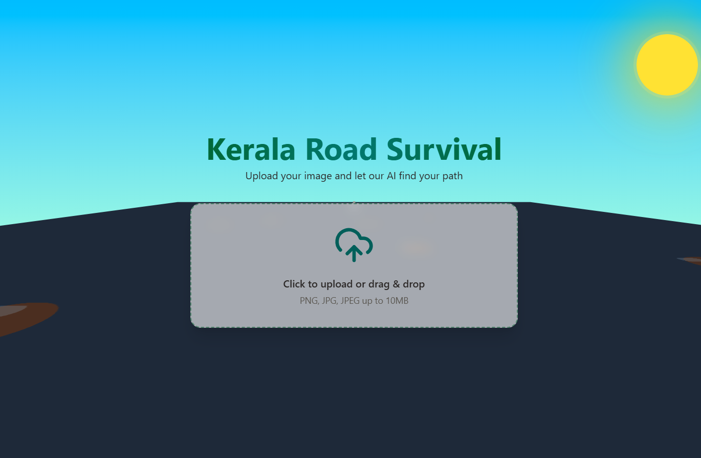
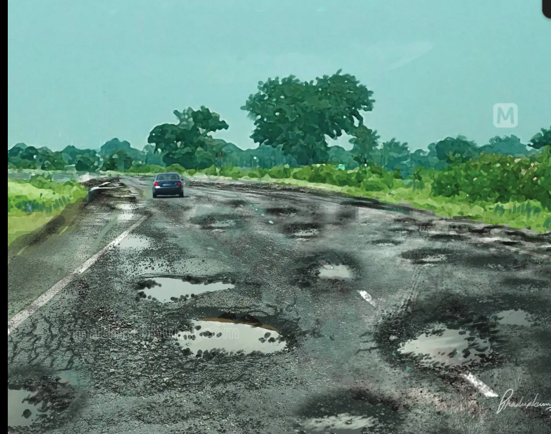
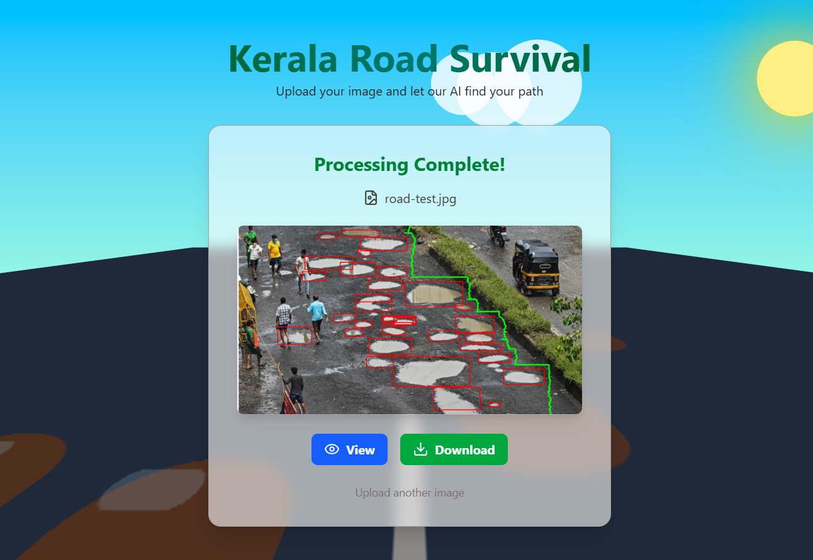

# KERALA ROAD SURVIVAL🎯

## Basic Details
### Team Name: DeadLinerZ

### Team Members
- Team Lead: Anugrah M V - Department Of IT, Kannur University Campus, Mangattparamba
- Member 2: Adith V - Department Of IT, Kannur University Campus, Mangattparamba

### Project Description
An AI-powered system that takes an image of a road and magically figures out the safest path to drive or ride without hitting a single pothole — because apparently, swerving in style is the new trend. We have trained the AI Model with the pathole dataset to recognize and label the patholes and then uses A* Algorithm for finding the safest path without hitting the pothole. and developed a flask API for this and connect it with a reactJS frontend using the RestAPI.

### The Problem (that doesn't exist)
Sometimes you’re riding your bike and you accidentally avoid potholes. Boring. We wanted to make sure you avoid them strategically with the precision of a GPS-guided missile — even though your eyes work just fine.

### The Solution (that nobody asked for)
We trained an AI to look at a road, find every pothole, and chart a “royal procession” route around them. It uses pathfinding algorithms normally reserved for video games, because why not make avoiding potholes feel like winning a level in Mario Kart?

## Technical Details
### Technologies/Components Used
For Software:
- Python, JavaScript
- Flask, ReactJS
- YOLO, 
- Google Collabe, VSCode

### Implementation
# Installation
cd useless-project2025
npm install
cd pothole-api
pip install -r requirements.txt

# Run
1.npm run dev

2.cd pothole-api
python app.py

API Endpoint: localhost http://127.0.0.1:5000/predict

# Screenshots (Add at least 3)

Screenshot1

Input

Screenshot2

[!Screenshot3](assets/Screenshot3.png)
Output

## Team Contributions
- Anugrah: Frontend and API Development
- Adith: Model Development using YOLO in Google Collab

---
Made with ❤️ at TinkerHub Useless Projects 

!Static Badge (https://img.shields.io/badge/TinkerHub-24?color=%23000000&link=https%3A%2F%2Fwww.tinkerhub.org%2F)
!Static Badge (https://img.shields.io/badge/UselessProjects--25-25?link=https%3A%2F%2Fwww.tinkerhub.org%2Fevents%2FQ2Q1TQKX6Q%2FUseless%2520Projects)